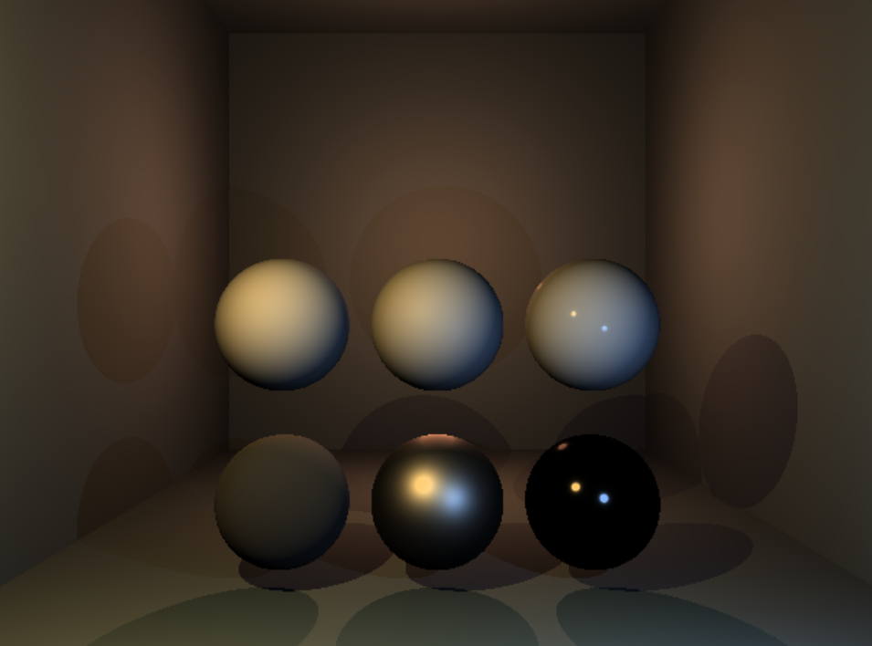
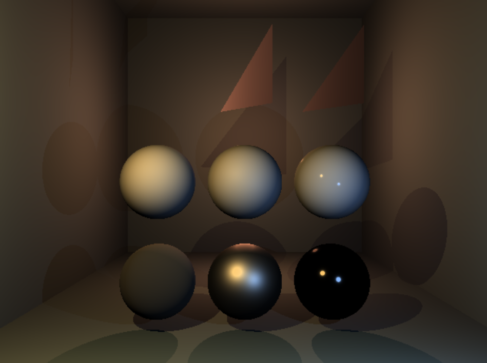
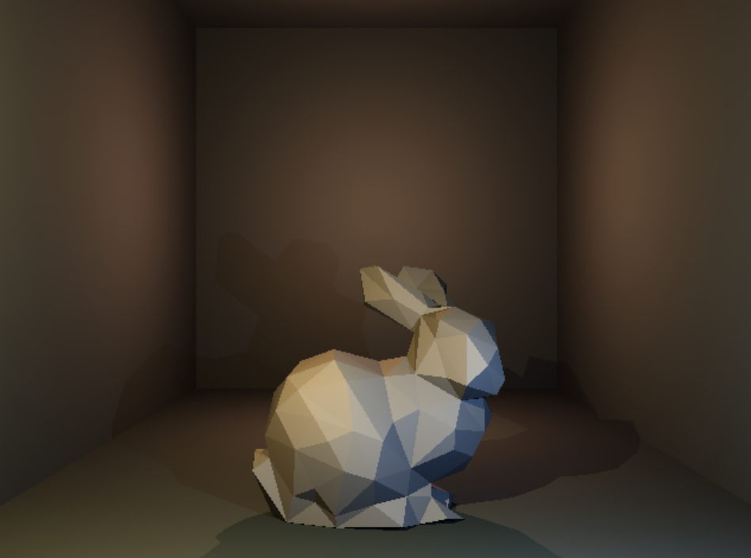

# Simple Raytracer

This project is a simple [raytracer](https://en.wikipedia.org/wiki/Ray_tracing_(graphics)) developed during my third semester of college. The project was completed over the course of 4 weeks and serves as a fundamental learning tool for graphics programming. The start project was provided by my teachers, including helper functionality and basic vector logic.

## Overview

The raytracer is implemented in C and C++ and uses multithreading to improve the framerate, although it remains relatively low as everything is rendered using the CPU only. The project includes three [release builds](https://github.com/Juddy2403/GP1_Raytracer/releases), each with different scene settings to showcase the capabilities of the raytracer.

## Camera Controls

The camera controls mimic the [Unreal Engine controls](https://dev.epicgames.com/documentation/en-us/unreal-engine/viewport-controls-in-unreal-engine). Below is a table of the available controls:

| Action                | Key/Mouse Input                      | Description                                                               |
|-----------------------|--------------------------------------|---------------------------------------------------------------------------|
| Move Forward          | `W`                                  | Moves the camera forward.                                                 |
| Move Backward         | `S`                                  | Moves the camera backward.                                                |
| Move Left             | `A`                                  | Moves the camera to the left.                                             |
| Move Right            | `D`                                  | Moves the camera to the right.                                            |
| Look Around           | `RMB` + `Move Mouse`                   | Rotates the camera based on mouse movement.                               |
| Move Up/Down          | `LMB` + `RMB` + `Move Mouse Y`            | Moves the camera up or down based on vertical mouse movement.             |
| Move Forward/Backward | `LMB` + `Move Mouse Y`                 | Moves the camera forward or backward based on vertical mouse movement.    |
| Look Left/Right       | `LMB` + `Move Mouse X`                | Rotates the camera horizontally based on horizontal mouse movement.       |

Note: `Move Mouse X` and `Move Mouse Y` refer to horizontal and vertical mouse movements, respectively.

## Developer installation

To build and run the project, follow these steps:

1. Clone the repository:
    ```sh
    git clone https://github.com/Juddy2403/GP1_Raytracer.git
    ```

2. Navigate to the source directory

3. Run the solution file RayTracer.sln

## Usage

To run the raytracer with a specific scene configuration, go to main.cpp and on line 48 change the created scene with one of the other Scene inherited classes from the Scene.h file. For example:
```c++
const auto pScene = new Scene_W4_Bunny();
```

## Releases

You can find the three release builds in the Releases section of this repository. Each release demonstrates a different scene configuration:

- [**Spheres Release:**](https://github.com/Juddy2403/GP1_Raytracer/releases/tag/V1.0) Simple scene with 6 spheres
  
  
  
- [**Spheres and Triangles Release:**](https://github.com/Juddy2403/GP1_Raytracer/releases/tag/V2.0) Simple scene with 6 spheres and 3 triangles

  
  
- [**Bunny mesh Release:**](https://github.com/Juddy2403/GP1_Raytracer/releases/tag/V3.0) Simple scene with an .obj file rendered mesh

  
 
## Code Documentation

### Renderer.h and Renderer.cpp
- **Renderer Class:** Handles rendering logic using the SDL library. It includes methods for initializing the rendering surface, rendering scenes and pixels, and saving the rendered buffer to an image.
- **Multithreading:** Uses parallel execution to improve rendering performance, although framerate remains low due to CPU-only rendering.
- **Lighting Modes:** Supports multiple lighting modes including Observed Area, Radiance, BRDF, and Combined.

### Scene.h and Scene.cpp
- **Scene Class:** Manages the scene objects, including spheres, planes, triangle meshes, and lights. It provides methods for initializing and updating the scene, as well as handling ray intersections.
- **Scene Variants:** Includes different scene configurations for testing purposes, such as Scene_W1, Scene_W2, Scene_W3, Scene_W4_Reference, and Scene_W4_Bunny.

### Camera.h
- **Camera Struct:** Manages the camera's position, orientation, and field of view. It provides methods for updating the camera based on user input and calculating the camera-to-world transformation matrix.

### Timer.h and Timer.cpp
- **Timer Class:** Handles timing logic for the application, including calculating frames-per-second (FPS) and benchmarking performance.

### BRDFs.h
- **BRDF Functions:** Implements various Bidirectional Reflectance Distribution Functions (BRDFs) for shading calculations, including Lambert, Phong, Fresnel, and GGX.

### Utils.h
- **Utility Functions:** Provides various utility functions for geometry and light calculations, as well as parsing OBJ files for mesh data.

### Math.h, Matrix.h, Matrix.cpp, Vector3.h, Vector3.cpp, Vector4.h, Vector4.cpp
- **Math Utilities:** Includes math utilities and classes for vector and matrix operations, essential for graphics programming and raytracing calculations.

## Learning Experience

This project was a great way for me to learn and better understand graphics programming. While there are many improvements that could be made, I have decided not to work further on the project as it has already served its purpose in my learning journey.

## Future Improvements

While I am not planning to continue development on this project, here are some potential improvements that could be made:

- Implement GPU-based rendering for better performance
- Add more complex shading models
- Improve multithreading efficiency
- Add more advanced scene configurations and objects

## Acknowledgments

I would like to thank my teachers for providing the initial project setup and guiding me through the process. Their notes and the starter project included vector logic and other helper functions which were instrumental in getting the project off the ground.


## Contact

For any questions or further information, feel free to contact me through my GitHub profile.


